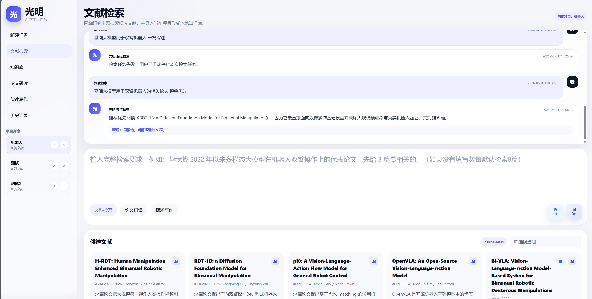
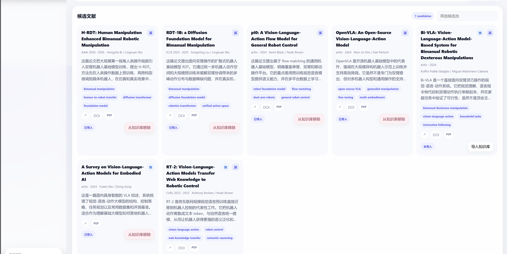
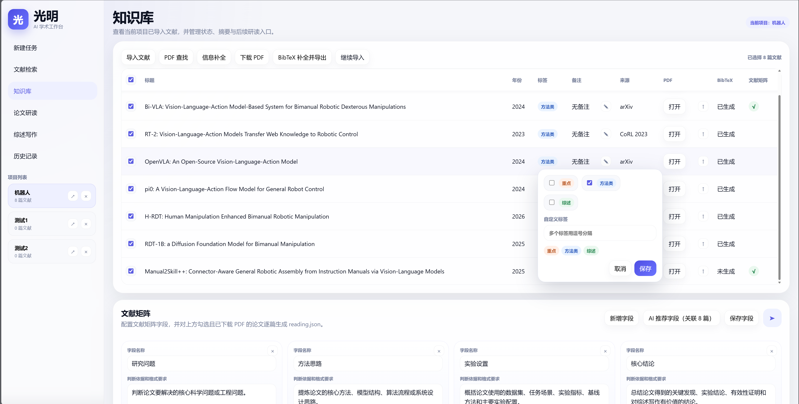
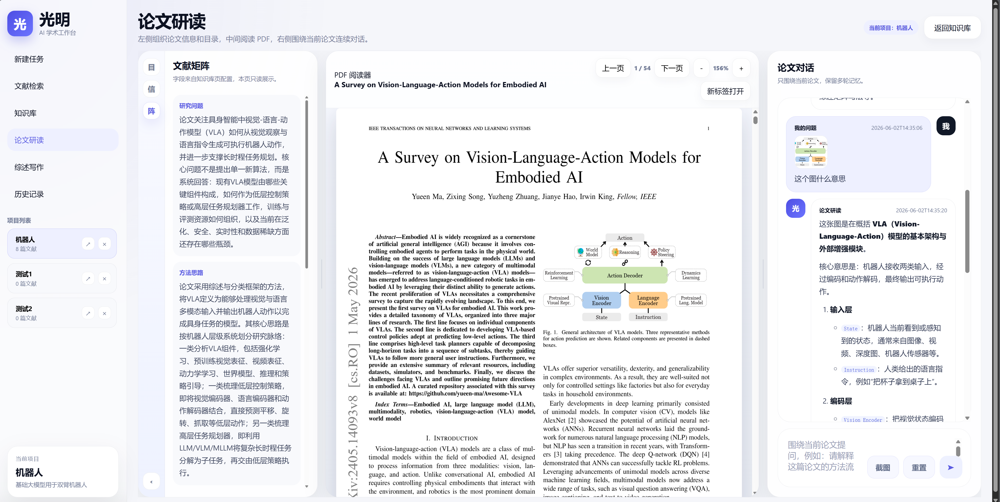
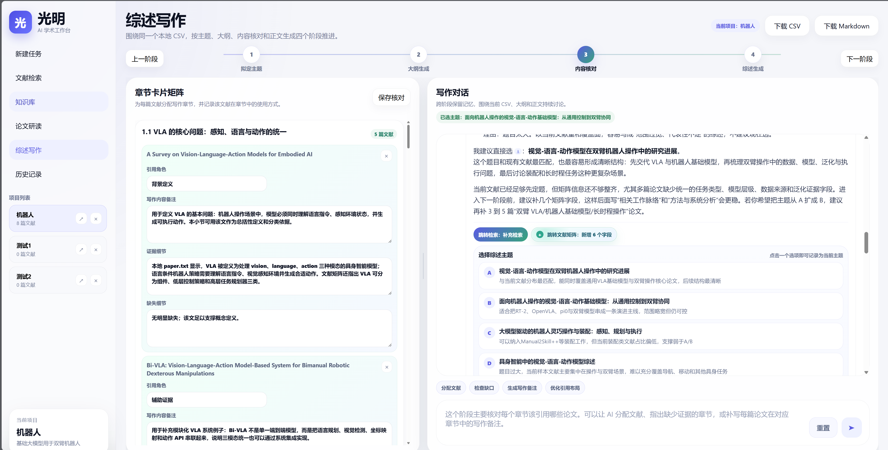

# Guangming AI Workbench

面向科研综述写作的本地 Python Web 工作台。系统围绕一个本地项目目录组织文献检索、知识库管理、论文研读、文献矩阵和综述写作，让 AI 对话、结构化 JSON、PDF、BibTeX 和 Markdown 产物都落到可追踪的本地文件中。

## 界面与工作流

### 1. 文献检索：从自然语言需求到候选文献池



检索入口是一个面向完整需求的对话框，而不是简单关键词输入框。用户可以描述主题、年份、数量、重点方向或筛选条件；系统支持快速检索和深度检索两种模式。深度检索通过仓库内 `academic-search-only` skill 显式注入 Codex SDK，检索过程会产生可追踪的运行记录。



检索结果先写入 `search_runs/`，再由后端归一化、去重并合并到 `candidate_papers.json`。候选文献卡片展示标题、作者、年份、venue、中文摘要、关键词、DOI、PDF 等信息，并支持导入知识库。

### 2. 知识库：管理正式纳入项目的论文



知识库用于管理已经导入项目的正式文献。页面支持批量选择、标签、备注、PDF 查找、下载 PDF、BibTeX 补全并导出、继续导入等操作。下方的文献矩阵面板可以配置项目级字段，支持 AI 推荐字段，并对已下载 PDF 的论文逐篇生成结构化 `reading.json`。

### 3. 论文研读：PDF、文献矩阵与连续问答



论文研读页采用左中右布局：左侧展示论文信息、目录和文献矩阵，中间连续阅读 PDF，右侧围绕当前论文进行多轮对话。对话支持截图提问和剪贴板图片粘贴，方便直接围绕论文图表、公式或局部内容发问。

### 4. 综述写作：围绕 CSV 和文献矩阵逐步生成综述



综述写作工作台分为拟定主题、大纲生成、内容核对、综述生成四个阶段。系统会维护本地 `writing_sources.csv`、`outline.md`、`writing_section_mappings.json` 和 `survey.md`。第三阶段按叶子小节分配引用文献，并为每个“小节-文献”组合记录写作内容备注、证据细节和缺失细节，最终服务于 Markdown 综述生成。

## 核心能力

- 本地项目化：每个研究主题对应一个独立目录，数据、PDF、BibTeX、Markdown 产物都可追踪。
- AI 检索闭环：从自然语言检索要求出发，形成候选池，再导入知识库。
- 知识库工程化：统一管理元数据、标签、备注、PDF、本地路径、BibTeX 和文献矩阵状态。
- 结构化研读：用项目级字段把论文提炼成统一文献矩阵，便于后续比较和综述写作。
- 多轮上下文：知识库问答、论文研读、综述写作分别维护连续对话记忆。
- 写作可落地：综述写作不只输出聊天文本，而是持续更新本地 CSV、大纲、章节映射和 Markdown 正文。

## 实现原理

- Flask 提供 Web 页面、JSON API 和后台任务入口。
- 项目数据以 `workspace/projects/<project_id>/` 为边界，主要用 JSON 表保存状态。
- 单篇论文资产保存在 `papers/<paper_id>/`，包括 `metadata.json`、`paper.pdf`、`bibtex.bib`、`reading.json` 等。
- 搜索、知识库问答、论文研读、文献矩阵、导入补全和综述写作均通过 Codex SDK 后台任务执行。
- Codex SDK 的运行缓存保存在 `instance/codex-home-web/`，该目录只保存本机运行状态、会话和缓存，不进入版本库。
- 仓库内 skill 作为源码保存在 `skills/academic-search-only/`，深度检索通过 `SkillInput` 显式传入 `SKILL.md` 的绝对路径，不依赖全局用户目录。

## 目录结构

```text
guangming-ai-workbench/
  app.py
  pyproject.toml
  uv.lock
  config/
    codex.example.json
    codex.local.json       # 本地私有配置，已 gitignore
  services/
  templates/
  static/
  docs/
  skills/
    academic-search-only/
  instance/                # Codex SDK 本地运行缓存，已 gitignore
  workspace/
    projects/              # 本地项目数据，已 gitignore
```

每个研究项目都会在 `workspace/projects/<时间戳-项目名>/` 下生成独立目录。完整项目文件结构见 [文件结构设计、表格字段与系统实现](docs/文件结构设计_表格字段_系统实现.md)。

## 环境配置

推荐使用 Python 3.12 和 `uv`。

```bash
uv sync
```

如需运行 Codex SDK 任务流：

```bash
uv sync --extra codex
```

复制配置模板并填写自己的模型服务配置：

```powershell
Copy-Item config/codex.example.json config/codex.local.json
```

`config/codex.local.json` 示例字段：

```json
{
  "api_key": "sk-your-api-key",
  "base_url": "https://api.openai.com/",
  "model": "gpt-5.4",
  "model_provider": "project-openai",
  "wire_api": "responses",
  "reasoning_effort": "high",
  "disable_response_storage": true
}
```

`codex.local.json` 已加入 `.gitignore`，不要提交真实密钥。

Windows PowerShell 5.1 如遇中文乱码，可在当前终端先切换 UTF-8：

```powershell
chcp 65001
$OutputEncoding = [Console]::OutputEncoding = [Text.UTF8Encoding]::new()
```

## 运行方式

```bash
uv run python app.py
```

或在已创建的虚拟环境中运行：

```powershell
.\.venv\Scripts\python.exe app.py
```

打开：

```text
http://127.0.0.1:5000
```

## 文档入口

- [产品需求与验收标准](docs/需求文档_产品需求与验收标准.md)
- [页面原型说明与组件清单](docs/页面原型说明与组件清单.md)
- [文件结构设计、表格字段与系统实现](docs/文件结构设计_表格字段_系统实现.md)

## 注意事项

- `instance/` 是本机 Codex SDK 运行缓存，保留在仓库根目录但不提交。
- `workspace/projects/` 是本地项目数据目录，不提交到 git。
- `skills/academic-search-only/` 是深度检索 skill 的源码目录，需要随仓库同步。
- `config/codex.local.json` 包含私有 API 配置，不提交到 git。
